汉诺塔是一个经典的益智游戏，源自于印度数学家毕达哥拉斯所提出的问题。该游戏通常由三个柱子和若干个圆盘组成，目标是将若干个圆盘从起始柱子移动到目标柱子（且保持圆盘的排列顺序不变），同时遵守以下规则：

1. 每次只能移动一个圆盘。
2. 大圆盘不能放在小圆盘上面。


<center>图 1：汉诺塔</center><br>

问题：如果将若干个圆盘从起始柱子 a 移动到目标柱子 c 上？（最少要移动多少次？）
提示：可将圆盘临时置于 b 塔，也可将从 a 塔移出的圆盘重新移回 a 塔，但都必须遵循上述两条规则。

解题思路

汉诺塔游戏看起来很简单，但是其中蕴含了很多算法思想，比如说，我们可以使用递归的方法来解决这个问题，具体过程我们可以将其抽象成 3 个步骤。

1. 将 n - 1 个圆盘从塔 a 移动到塔 b。
2. 将第 n 个圆盘从塔 a 移动到塔 c。
3. 将 n - 1 个圆盘从塔 b 移动到塔 c。

也就是说想要解决 n 层的汉诺塔问题，就需要先解决 n - 1 层的汉诺塔问题......这样我们最终将一个大的问题分解成多个小的问题，具体过程如下：

要想将塔 a 的圆盘全部移动到塔 c 中，那么必然要将塔 a 中的最大的圆盘，率先落入到塔 c 中。


<center>图 2：将最大的圆盘落入塔 c 中</center><br>

那么遵循上述的游戏规则，要想实施刚刚的操作那么就必将会出现下面这一情况。（使得我们将最大的圆盘从塔 a 移动到塔 c 中畅通无阻）这也是为什么在抽象过程中，第一步就是要将 n - 1 个圆盘从塔 a 移动到塔 b 的原因。


<center>图 3：第一步将 n - 1 个圆盘从塔 a 移动到塔 b</center><br>

现在最大的圆盘已经抵达了它应在的位置，它的位置已经固定不再会移动了，所以我们不在需要考虑它了，甚至我们可以将它忽略掉！



<center>图 4：第二步将第 n 个圆盘从塔 a 移动到塔 c</center><br>

接下来要考虑的问题就是如何将‘塔 a 上的两个圆盘全部移动到塔 b 中’或是‘塔 b 上的两个圆盘全部移动到塔 c 中’，等等这个问题与我们最开始讨论的问题是不是有些相似“要想将塔 a 上的三个圆盘全部移动到塔 c 中”。


<center>图 5：第三步将 n - 1 个圆盘从塔 b 移动到塔 c</center><br>

也就是说，我们现在将拥有三个圆盘的汉诺塔问题简化成拥有两个圆盘的汉诺塔问题，换而言之要想解决拥有三个圆盘的汉诺塔问题，就需先解决将拥有二个圆盘的汉诺塔问题。（因为我们只要完成二个圆盘的汉诺塔问题，就可执行图 2 中最开始的操作“将最大的 3 号圆盘从塔 a 移动到塔 c 中”完成解题）
此刻要解决的就是拥有二个圆盘的汉诺塔问题，那么以当前思路来说，我们是否可以继续简化这两层的汉诺塔问题，结果肯定是可以的。
这时我们可以发现，当要解决 n 层汉诺塔问题时，就需要先解决 n - 1 层的汉诺塔问题。


<center>图 6：汉诺塔递归</center><br>

那么如何计算需要多少步，首先移动 1 层的我们从上图中可以看出，如果想要移动 n 层圆盘，它包含两个移动 n - 1 层圆盘，还有一个移动第 n 层圆盘，移动第 n 层圆盘就是一步，所以我们就有以下等式。


在这里我们以 F(n) 代表移动 n 层圆盘的步数，我们简单计算一下：移动 1 层圆盘需要 F(1) = 1 步、移动 2 层圆盘需要 F(2) = 3 步、移动 3 层圆盘需要 F(3) = 7 步，总结一下分别为： 1 层为二的一次方减一、2 层为二的二次方减一、3 层为二的三次方减一。


<center>图 7：汉诺塔各层步数对比</center><br>

程序求解

```c
#include <stdio.h>

void message(int n, char from, char to) {
    printf("将 %d 号圆盘, 从塔 %c 移动到塔 %c\n", n, from, to);
}

void hanoi(int n, char a, char b, char c) {
    if (n == 1) {
        // 汉诺塔中只有一个圆盘直接将圆盘从塔 a 移动到塔 c。
        message(n, a, c);

        return;
    }

// 将 n - 1 个圆盘从塔 a 移动到塔 b。
    hanoi(n - 1, a, c, b);

// 将第 n 个圆盘从塔 a 移动到塔 c。
    message(n, a, c);

// 将 n - 1 个圆盘从塔 b 移动到塔 c。
    hanoi(n - 1, b, a, c);
}

int main() {
    hanoi(3, 'a', 'b', 'c');

    return 0;
}
```

<center>code 1：C 语言汉诺塔递归求解步骤</center><br>

```c
#include <stdio.h>

int main() {
    int calculate(int num) {
        if (num == 1) {
            return 1;
        }

        return 2 * calculate(num - 1) + 1;
    }

    for (int i = 1; i <= 9; i++) {
        printf("%d --> %d\n", i, calculate(i));
    }

    return 0;
}
```

<center>code 2：C 语言汉诺塔递归求解步数</center><br>
