素数（也称为质数）的定义是一个大于 1 的自然数，除了 1 和它本身以外，不能被其他正整数整除。换句话说，一个素数只有两个正因数：1 和它自己。
例如，2、3、5、7、11、13、17、19、23 等都是素数，因为它们只能被 1 和它们自身整除。而 4、6、8、9、10 等不是素数，因为它们可以被其他的正整数整除，比如 4 可以被 2 整除，6 可以被 2 和 3 整除，以此类推。
素数在数学中有着重要的地位，特别是在数论领域。许多数学定理和算法都与素数有关，包括著名的费马小定理和欧拉定理。

判断一个数是否为素数：
在 code - 1 中，我们定义了一个名为 is_prime 的函数，它接受一个整数作为参数，并返回一个布尔值，表示该整数是否为素数。如果输入的整数小于等于 1，则不是素数；否则，我们从 2 开始遍历到该整数的平方根，如果该整数可以被任何一个小于它的正整数整除，则不是素数。

```c
#include <stdio.h>

int is_prime(int n) {
    if (n <= 1) {
        return 0;
    }

    for (int i = 2; i * i <= n; i++) {
        if (n % i == 0) {
            return 0;
        }
    }

    return 1;
}

int main() {

    int n = 6;

    if (is_prime(n)) {
        printf("%d is a prime number.\n", n);
    } else {
        printf("%d is not a prime number.\n", n);
    }

    return 0;
}
```

<center>code - 1：判断一个整数是不是素数</center><br>

在判断一个整数是否为素数时，我们通常从 2 开始遍历到该整数的平方根。这是因为如果一个整数不是素数，那么它可以表示为两个因数的乘积，其中一个因数必然小于或等于它的平方根。 例如，假设我们要判断 10 是否为素数。我们可以从 2 开始遍历到 3（因为 3 的平方是 9，小于 10），并检查 10 是否可以被这些数字整除。如果我们发现 10 可以被某个数字整除，那么它就不是素数；否则，它就是素数。 在这个例子中，我们只需要检查到 3 就可以确定 10 不是素数，因为 10 可以表示为 2 和 5 的乘积，其中 5 大于 3，而 2 小于 3。因此，我们不需要继续检查大于 3 的数字。 同样地，对于更大的整数，我们只需要检查到它的平方根就可以确定它是否为素数。这是因为**如果一个整数不是素数，那么它可以表示为两个因数的乘积，其中一个因数必然小于或等于它的平方根**。如果我们没有找到这样的因数，那么这个整数就是素数。 因此，从 2 开始遍历到该整数的平方根是一种有效的算法，可以快速判断一个整数是否为素数。

证明过程：
假设一个整数 n 不是素数，那么它可以表示为两个因数的乘积：n = a \* b。其中，a 和 b 都是大于 1 的正整数。 我们可以通过以下步骤来证明其中一个因数必然小于或等于 n 的平方根：

1. 如果 a 或 b 等于 n，那么另一个因数就是 1，这与题目条件不符，因此我们可以排除这种情况。
2. 如果 a 和 b 都大于 n 的平方根，那么它们的乘积就会大于 n，这与题目条件不符，因此我们可以排除这种情况。
3. 因此，至少有一个因数（不妨设为 a）小于或等于 n 的平方根。
4. 假设 a 大于 n 的平方根，那么 b 就会小于 n 的平方根，因为 a \* b = n。但是这与我们的假设矛盾，因此 a 必须小于或等于 n 的平方根。 因此，如果一个整数 n 不是素数，那么它可以表示为两个因数的乘积，其中一个因数必然小于或等于它的平方根。

查找素数：
注意到一个正整数是不可能写成比自身还大的两个正整数的乘积的，并且如果一个正整数能被大于 2 且小于自身的数字整除的话，那么该数字必然不是素数。因此，我们从 2 开始遍历，将 2 的整数倍去除掉，那么剩下的下一个数字必然为素数。为了表达一个数字是否为素数，我们将数组下标做为要表示的数字，数组内容表示该索引对应的数字是否为素数，如 numbers[2] = 1 表示的含义是数字 2 为 素数，而表达式 a[4] = 0 则表示数字 4 不是素数。

```c
#include <stdio.h>

void prime_number(int n) {

    int numbers[n];

    for (int i = 2; i < n; i++) {
        numbers[i] = 1;
    }

    for (int i = 2; i < n; i++) {
        int is_prime = numbers[i];

        if (is_prime == 0) {
            continue;
        }

        for(int k = 2 * i; k < n; k += i) {
            numbers[k] = 0;
        }
    }

    int count = 0, number_per_line = 10;
    for (int i = 2; i < n; i++) {
        if (numbers[i] == 0) {
            continue;
        }

        printf("%d\t", i);

        count++;
        if (count == number_per_line) {
            printf("\n");
            count = 0;
        }
    }

}

int main() {

    prime_number(1000);

    return 0;
}
```

<center>code - 2：利用数组找到给定范围内的所有素数</center><br>



<center>图 1：code - 2 中求解素数示意图</center><br>

查找更多素数：
为了求解更多的素数，可以通过位的形式对程序进行改写。事实上，我们仅使用了数字 0、1 来表示一个索引是否为素数，而保存这两个数字使用 4 个字节是存在显著浪费的。
要知道在计算机中所有数据都是以二进制的形式进行存储的，而在我们当前的 C 语言程序中一个 int 类型的数据所占有的空间为 4 字节（1 Byte = 8 bit）也就是 32 个二进制位。
在图 2 中我们就可以看出为何仅使用数字 0、1 会存在大量存储空间上的浪费，如果我们可以将每一个二进制位都利用起来，那么这可以大大的减少我们对存储空间上的消耗。


<center>图 2：数据在计算机中存储形式</center><br>


<center>图 3：利用二进制位减少数组长度</center><br>

```c
#include <stdio.h>

void prime_number(unsigned int n) {
    unsigned int scale = (sizeof(unsigned int) * 8);
    // 对数组长度进行取整，有小数需进一
    unsigned int len = (n + (scale - 1)) / scale;
    unsigned int numbers[len];

    numbers[0] = 0x3FFFFFFF;
    for (int i = 1; i < len; i++) {
        numbers[i] = 0xFFFFFFFF;
    }

    for (int i = 2; i < n; i++) {
        unsigned int index = i / scale;
        unsigned int offset = (scale - (i % scale)) - 1;

        if ((numbers[index] & (1 << offset)) == 0) {
            continue;
        }

        for (int k = i * 2; k < n; k = k + i) {
            index = k / scale;
            offset = (scale - (k % scale)) - 1;

            numbers[index] &= ~(1 << offset);
        }
    }

    int count = 0, numbers_per_line = 10;
    for (int i = 2; i < n; i++) {
        unsigned int index = i / scale;
        unsigned int offset = (scale - (i % scale)) - 1;

        if ((numbers[index] & (1 << offset)) == 0) {
            continue;
        }

        printf("%d\t", i);

        count++;
        if (count == numbers_per_line) {
            printf("\n");
            count = 0;
        }
    }
}

int main() {

    prime_number(9999);

    return 0;
}
```


<center>图 4：位置定位</center><br>
