在 C 语言中，数组是将其相同类型元素存储在连续的内存空间中，数组通过变量名后加方括号表示，方括号里面是数组的元素数量。



<center>图 1：数组</center><br>

## 声明数组

数组通过变量名后加方括号表示，方括号里面是数组的元素数量，也就是: **类型 + 变量名称 + [一个正值的长度]，** 在 code - 1 中声明了名为 array 长度为 100 元素类型为 int 的数组。

```c
int array[100];
```

<center>code - 1：声明数组</center><br>

**数组中的元素是从 0 开始编号**，所以数组 array[100] 就是从第 0 号元素一直到第 99 号元素，最后一个元素的编号会比数组长度小 1。



<center>图 2：数组元素从 0 开始编号</center><br>

## 数组初始化

数组在声明时，可以使用大括号，同时对每一个元素赋值，但大括号里面的值不能多于数组的长度，否则编译时会报错。

```c
int array[6] = { 1, 2, 3, 4, 5, 6 };

int array[6] = { 1, 2, 3, 4, 5, 6, 7 }; // 报错
```

<center>code - 2：声明并初始化数组</center><br>

如果大括号里面的值，少于数组的元素数量，那么未赋值的元素自动初始化为 0，如果要将整个数组的每一个元素都设置为零，最简单的写法就是下面这样。

```c
int array[5] = { 1, 2, 3 };
// 等同于
int array[5] = { 1, 2, 3, 0, 0 };

int array[5] = { 0 };
// 等同于
int array[5] = { 0, 0, 0, 0, 0 }; // 100 个 0
```

<center>code - 3：未赋值的元素自动初始化为零</center><br>

但要注意！使用大括号赋值时，必须在数组声明时赋值，否则编译时会报错，其原因在于是，C 语言规定，数组变量一旦声明，就不得修改变量指向的地址，同样的原因，数组赋值之后，再用大括号修改值，也是不允许的。

```c
int array[6];
array = { 1, 2, 3, 4, 5, 6 }; // 报错

int array[6] = { 1, 2, 3, 4, 5, 6 };
array = { 6, 5, 4, 3, 2, 1 }; // 报错
```

<center>code - 4：使用大括号修改数组值</center><br>

数组初始化时，可以指定为哪些位置的元素赋值，因为是制定的元素赋值，所以可以不按照顺序任意赋值，并且指定位置的赋值与顺序赋值，可以结合使用，但不建议这样做，会增加读代码的难度。

```c
int array[12] = { [2] = 22, [9] = 99, [11] = 122 };
// 等同于
int array[12] = { 0, 0, 22, 0, 0, 0, 0, 0, 0, 99, 0, 122 };

int array[12] = { [9] = 22, [2] = 99, [11] = 122 };
// 等同于
int array[12] = { 0, 0, 99, 0, 0, 0, 0, 0, 0, 22, 0, 122 };

int array[12] = { 1, 2, 3, [2] = 22, [9] = 99, [2] = 44, 88, [11] = 122 };
// 等同于
int array[] = { 1, 2, 44, 88, 0, 0, 0, 0, 0, 99, 0, 122 }
```

<center>code - 5：指定位置的元素赋值</center><br>

**C 语言允许省略方括号里面的数组元素数量**，这时将根据大括号里面的值的数量，自动确定数组的长度，省略成员数量时，如果同时采用指定位置的赋值，那么数组长度将是最大的指定位置再加 1。

```c
int a[] = { 1, 2, 3 }; // 数组长度为 3

int a[] = { [9] = 12 } // 数组长度为 10
```

<center>code - 6：自动推算数组长度</center><br>

## 访问数组元素

上面示例中，数组 array 只有 100 个元素，因此 array[100] 这个位置是不存在的，但是！引用这个位置并不会报错，会正常运行，使得紧跟在 array 后面的那块内存区域被赋值，而那实际上是其他变量的区域，因此不知不觉就更改了其他变量的值，这很容易引发错误，而且难以发现。

## 计算数组长度

计算数组长度可以使用 sizeof 函数，sizeof 可以获得数据类型或变量在内存中所占的字节数，同样，用 sizeof 也可以获得整个数组在内存中所占的字节数，因为数组中每个元素的类型都是一样的，在内存中所占的字节数都是相同的，所以总的字节数除以一个元素所占的字节数就是数组的长度。

```c
#include <stdio.h>

int main() {
    int array[] = { 1, 2, 3, 4, 5, 6 };
    int len = sizeof(array) / sizeof(array[0]);

    printf("len = %d\n", len);

    return 0;
}
```

<center>code - 7：计算数组长度</center><br>
