链表是一种线性数据结构，其中的每一个元素都是一个节点，其中每一个节点都通过指针相连接，指针记录了下一个节点的内存地址，通过它可以从当前节点访问到下一个节点。


<center>图 1：链表</center><br>

要知道计算机中的内存空间是所有程序的公共资源，在一个复杂的系统运行环境下，空闲的内存空间可能散落在内存各处，我们知道，存储数组的内存空间必须是连续的，而当数组非常大时，内存可能无法提供如此大的连续空间，此时链表的灵活性优势就体现出来了。



<center>图 2：链表的各个节点可以分散存储在内存各处（它们的内存地址无须连续）</center><br>

链表中的每个节点由两部分构成，一是本身存储的数据信息（数据域），二是指向后续节点的指针（指针域）这两部分信息组成的存储结构称之为链表的“节点”

## 链表的结构定义

从图 2 中可以看出分散存储是链表最显著的特征，但为了能够保持节点之间的顺序关系，每个节点在存储数据的同时都要配置一个指针，用于指向它的直接后继元素。

```c
#include <stddef.h>

// 链表节点结构体定义
typedef struct Node {
    int value; // 节点数据域
    struct Node* next; // 节点指针域，指向下一个节点的地址
} Node, *P_Node;

int main() {
    P_Node head = NULL; // 初始化链表

    return 0;
}
```

<center>code - 1：链表节点结构体定义（1）</center><br>

链表的首个节点被称为“头节点”，头节点通常包含指向下一个节点的指针。对于单链表来说，头结点是整个链表的入口，通过它可以遍历链表中的其他所有节点。如果链表为空，则头结点不存在，或者它的指针指向 NULL。
链表还拥有一个头指针，永远指向链表中第一个节点的位置，也就是链表中的“头节点”。


<center>图 3：头指针与头节点</center><br>

头指针与头节点的区别：

- 头指针只声明没有分配存储空间。
- 头节点进行了声明并分配了一个结点大小的实际物理内存。

在链表的实现中，有时人们会定义两个结构体，一个用于表示链表节点，另一个用于表示整个链表。这样做的原因主要是为了更好地管理链表的状态和提供更清晰的数据封装。

```c
#include <stddef.h>

// 链表节点结构体定义
typedef struct Node {
    int value; // 节点数据域
    struct Node* next; // 节点指针域，指向下一个节点的地址
} Node, *P_Node;

// 链表结构体定义
typedef struct List {
    P_Node head; // 链表头结点
    int size; // 链表大小（节点数量）
} List;

int main() {
    List list = {
        .head = NULL
    }; // 初始化链表

    return 0;
}
```

<center>code - 2：链表节点结构体定义（2）</center><br>

从以上代码中可以看出，链表节点 Node 除了包含值，还需额外保存一个指针，**因此在相同数据量下，链表比数组占用更多的内存空间。**

## 链表的常用操作

### 创建节点

创建链表节点一般情况下需要使用 [malloc](https://en.cppreference.com/w/c/memory/malloc) 方法，该方法返回一个指针。如果分配内存成功，返回可用内存的起始地址，如果失败，则返回 NULL。需要注意的是 malloc 返回的指针类型是通用指针类型 void \* 需要根据程序需要进行强制类型转换。**每个使用 malloc 分配的内存可以确保是地址连续的内存空间。多次使用 malloc 分配内存时，不能确保每个独立内存的起始地址是连续的。**使用 malloc 方法得到的内存不会执行内存清零操作，由于动态内存区可被重复使用，因此，程序作者一定要对内存进行初始化操作。

```c
// 创建新节点函数
P_Node create_node(int val) {
    P_Node new_node = (P_Node)malloc(sizeof(Node)); // 分配内存空间

    if (new_node == NULL) {
        printf("Memory allocation failed.\n");
        return NULL;
    }

    new_node->value = val; // 初始化数据域
    new_node->next = NULL; // 初始化指针域

    return new_node;
}
```

<center>code - 3：创建链表节点</center><br>



<center>图 4：创建链表节点</center><br>

### 插入节点

```c
// 在链表末尾添加节点函数
void append_node(List *list, P_Node node) {
    if (list->head == NULL) { // 如果链表为空，则将节点设为头节点
        list->head = node;
        return;
    }

    P_Node last = list->head;

    while (last->next != NULL) {
        last = last->next;
    }

    last->next = node; // 将节点添加到链表末尾
}
```

<center>code - 4：插入节点</center><br>

### 查找节点

```c
// 查找链表中的第一个具有给定值 val 的节点（如果没有则返回 NULL）
P_Node search_node(List list, int val) {
    while (list.head != NULL) {
        if (list.head->value == val) {
            return list.head; // 找到了返回与给定值相同的节点
        }
        list.head = list.head->next;
    }

    return NULL; // 如果没有找到，则返回 NULL
}
```

<center>code - 5：查找节点</center><br>

### 删除节点

```c
void delete_node(List *list, P_Node node) {
    if (list->head == NULL) { // 如果链表为空，则无需删除
        return;
    }

    if (list->head == node) { // 如果要删除的节点是链表中第一个节点
        list->head = node->next; // 直接修改链表头指向下一个节点
        node->next = NULL; // 清除已删除节点的 next，使其与链表彻底隔离
        free(node); // 释放 malloc 函数申请的空间
        return;
    }

    P_Node last = list->head;
    while (last->next != NULL) {
        if (last->next == node) {
            last->next = node->next;
            node->next = NULL;
            free(node);
            return;
        }
        last = last->next;
    }
}
```

<center>code - 6：删除节点</center><br>

### 打印节点

```c
void print_list(List list) {
    while (list.head != NULL) {
        printf("%d-->", list.head->value);
        list.head = list.head->next;
    }
    printf("NULL\n");
}
```

<center>code - 7：打印节点</center><br>

### 完整代码

```c
#include <stddef.h>
#include <stdlib.h>
#include <stdio.h>

// 链表节点结构体定义
typedef struct Node {
    int value; // 节点数据域
    struct Node* next; // 节点指针域，指向下一个节点的地址
} Node, *P_Node;

// 链表结构体定义
typedef struct List {
    P_Node head; // 链表头结点
    int size; // 链表大小（节点数量）
} List;

P_Node create_node(int val) {
    P_Node new_node = (P_Node)malloc(sizeof(Node)); // 分配内存空间

    if (new_node == NULL) {
        printf("Memory allocation failed.\n");
        return NULL;
    }

    new_node->value = val; // 初始化数据域
    new_node->next = NULL; // 初始化指针域

    return new_node;
}

void append_node(List *list, P_Node node) {
    if (list->head == NULL) { // 如果链表为空，则将节点设为头节点
        list->head = node;
        return;
    }

    P_Node last = list->head;

    while (last->next != NULL) {
        last = last->next;
    }

    last->next = node; // 将节点添加到链表末尾
}

// 查找链表中的第一个具有给定值 val 的节点（如果没有则返回 NULL）
P_Node search_node(List list, int val) {
    while (list.head != NULL) {
        if (list.head->value == val) {
            return list.head; // 找到了返回与给定值相同的节点
        }
        list.head = list.head->next;
    }

    return NULL; // 如果没有找到，则返回 NULL
}

void delete_node(List *list, P_Node node) {
    if (list->head == NULL) { // 如果链表为空，则无需删除
        return;
    }

    if (list->head == node) { // 如果要删除的节点是链表中第一个节点
        list->head = node->next; // 直接修改链表头指向下一个节点
        node->next = NULL; // 清除已删除节点的 next，使其与链表彻底隔离
        free(node); // 释放 malloc 函数申请的空间
        return;
    }

    P_Node last = list->head;
    while (last->next != NULL) {
        if (last->next == node) {
            last->next = node->next;
            node->next = NULL;
            free(node);
            return;
        }
        last = last->next;
    }
}

void print_list(List list) {
    while (list.head != NULL) {
        printf("%d-->", list.head->value);
        list.head = list.head->next;
    }
    printf("NULL\n");
}

int main() {
    List list = {
        .head = NULL,
        .size = 10
    }; // 初始化链表

    for (int i = 0; i < list.size; i++) {
        append_node(&list, create_node(i));
    }

    print_list(list);

    delete_node(&list, search_node(list, 0));
    delete_node(&list, search_node(list, 1));
    delete_node(&list, search_node(list, 2));
    delete_node(&list, search_node(list, 3));
    delete_node(&list, search_node(list, 4));
    delete_node(&list, search_node(list, 5));
    delete_node(&list, search_node(list, 6));
    delete_node(&list, search_node(list, 7));
    delete_node(&list, search_node(list, 8));
    delete_node(&list, search_node(list, 9));

    print_list(list);

    return 0;
}
```

<center>code - 8：完整代码</center><br>

## 常见链表类型

常见的链表类型包括三种：

- 单向链表：即前面介绍的普通链表。单向链表的节点包含值和指向下一节点的引用两项数据。我们将首个节点称为头节点，将最后一个节点称为尾节点，尾节点指向空 NULL 。
- 环形链表：如果我们令单向链表的尾节点指向头节点（首尾相接），则得到一个环形链表。在环形链表中，任意节点都可以视作头节点。
- 双向链表：与单向链表相比，双向链表记录了两个方向的引用。双向链表的节点定义同时包含指向后继节点（下一个节点）和前驱节点（上一个节点）的引用（指针）。相较于单向链表，双向链表更具灵活性，可以朝两个方向遍历链表，但相应地也需要占用更多的内存空间。

```c
typedef struct Node {
    int data; // 节点数据域
    struct Node* next; // 节点指针域，指向下一个节点的地址
    struct Node* prev; // 节点指针域，指向上一个节点的地址
} Node;
```

<center>code - 9：双向链表</center><br>



<center>图 5：常见链表类型</center><br>
