在计算机科学中，数据结构是软件开发的基础，它们负责组织和存储数据以优化算法性能。其中，队列是一种基础且广泛应用的线性数据结构，尤其在多任务处理、消息传递、操作系统调度等领域具有重要作用。本文将重点探讨如何在 C 语言中实现并操作队列。

## 队列的概念

队列（queue）遵循**先进先出**的原则，就像现实生活中排队等待服务的情景一样，最先到达的元素最先离开。


<center>图 1：队列</center><br>

## 队列的常用操作

我们将队列头部称为“队首”，尾部称为“队尾”，队列有两个主要的操作：“入队”与“出队”，将把元素加入队尾的操作称为“入队”，删除队首元素的操作称为“出队”。


<center>图 2：队列遵循先入先出</center><br>

## 队列的实现

为了实现队列，我们需要一种数据结构，可以在一端添加元素，并在另一端删除元素，链表和数组都符合要求。

### 基于链表实现

我们可以将链表的“头节点”和“尾节点”分别视为“队首”和“队尾”，规定队尾仅可添加节点，队首仅可删除节点。



<center>图 3：基于链表实现队列</center><br>

```c
#include <stdlib.h>

typedef struct Node {
    int data;
    struct Node *next;
} Node, *P_Node;

typedef struct Queue {
    P_Node front; // 队头指针
    P_Node rear;  // 队尾指针
    int size;
} Queue, *P_Queue;

P_Queue create_queue() {
    P_Queue queue = (P_Queue)malloc(sizeof(Queue));

    if (queue != NULL) {
        queue->front = NULL;
        queue->rear = NULL;
        queue->size = 0;
    }

    return queue;
}

P_Node create_node(int value) {
    P_Node node = (P_Node)malloc(sizeof(Node));

    if (node != NULL) {
        node->data = value;
        node->next = NULL;
    }

    return node;
}
```

<center>code - 1：链式实现队列</center><br>

入队操作：将要入队的节点插入到当前队列尾节点的后面，最后将尾节点变更为当前将要入队的节点。



<center>图 4：基于链表实现队列入队操作</center><br>

```c
void push(P_Queue queue, int value) {
    P_Node node = create_node(value);
    if (node == NULL) {
        printf("Failed to allocate node\n");
        return;
    }

    if (queue->front == NULL) {
        // 当队列中没有节点时，头节点与尾节点均指向将要入队的节点
        queue->front = queue->rear = node;
    } else {
        // 将要入队的节点插入到当前队列尾节点的后面
        queue->rear->next = node;
        // 更换尾节点的指向，保证队列的尾节点总是指向实际的最后一个节点。
        queue->rear = node;
    }
    queue->size++;
}
```

<center>code - 2：链式实现队列出队操作</center><br>

出队操作：将当前队列头节点变更为头节点后下一个节点。



<center>图 5：基于链表实现队列出队操作</center><br>

```c
void pop(P_Queue queue) {
    if (queue->size == 0 && queue->front == NULL) {
        printf("Queue is null\n");
        return;
    }

    P_Node temp = queue->front;
    printf("%d\n", temp->data);
    queue->front = temp->next;
    queue->size--;
    free(temp);
}
```

<center>code - 3：链式实现队列入队操作</center><br>

### 基于数组实现

在数组中删除首元素时需要对当前数组进行遍历以确定首元素所在位置，这会导致出队操作效率较低。然而，我们可以采用以下巧妙方法来避免这个问题。
我们可以使用一个变量 front 指向队首元素的索引，并维护一个变量 size 用于记录队列长度。定义 rear = front + size ，这个公式计算出的 rear 指向队尾元素之后的下一个位置，基于此设计，数组中包含元素的有效区间为 [front, rear - 1]。


<center>图 6：基于数组实现队列</center><br>

```c
#include <stdlib.h>

typedef struct Queue {
    int *nums;
    int front;
    int size;
    int cap;
} Queue, *P_Queue;

P_Queue create_queue(int cap) {
    P_Queue queue = (P_Queue)malloc(sizeof(Queue));

    if (queue != NULL) {
        queue->cap = cap;
        queue->nums = (int*)malloc(sizeof(int) * queue->cap);
        if (queue->nums == NULL) {
            return NULL;
        }
        queue->front = queue->size = 0;
    }

    return queue;
}

int main() {
    return 0;
}
```

<center>code - 4：数组实现队列</center><br>

入队操作：将要入队的元素赋值给 rear 索引处，并将 size 增加 1 。


<center>图 7：基于数组实现队列入队操作</center><br>

```c
void push(P_Queue queue, int val) {
    if (queue->size == queue->cap) {
        printf("Queue is full\n");
        return;
    }

    // 将输入元素赋值给 rear 索引处
    int rear = (queue->front + queue->size) % queue->cap;
    queue->nums[rear] = val;

    // 并将 size 增加 1
    queue->size++;
}
```

<center>code - 5：数组实现队列入队操作</center><br>


<center>图 8：基于数组实现队列出队操作</center><br>

出队操作：只需将 front 增加 1 ，并将 size 减少 1 。

```c
void pop(P_Queue queue) {
    if (queue->size == 0) {
        printf("Queue is empty\n");
        return;
    }

    int elem = queue->nums[queue->front];
    printf("%d\n", elem);

    // 将 front 增加 1
    queue->front = (queue->front + 1) % queue->cap;

    // 将 size 减少 1
    queue->size--;
}
```

<center>code - 6：数组实现队列出队操作</center><br>

## 为什么要用模运算

模运算对于处理循环序列非常有用，例如，在当前数组或链表的索引循环中，通过使用模运算可以让索引值始终保持在有效范围内。例如，当你有一个长度为 n 的数组时，计算下标 i % n 可以确保下标总是在 0 到（n - 1）之间。



<center>图 9：模运算</center><br>
