栈是一种遵循**先入后出**的逻辑的线性数据结构。我们可以将栈类比为桌面上的一摞盘子，如果想取出底部的盘子，则需要先将上面的盘子依次移走。我们将盘子替换为各种类型的元素（如整数、字符、对象等），就得到了栈这种数据结构。



<center>图 1：栈</center><br>

## 栈的常用操作

我们把堆叠元素的顶部称为“栈顶”，底部称为“栈底”。将把元素添加到栈顶的操作叫作“入栈”，删除栈顶元素的操作叫作“出栈”。



<center>图 2：栈遵循先入后出</center><br>

## 栈的实现

为了深入了解栈的运行机制，我们来尝试自己实现一个栈。**栈遵循先入后出的原则，因此我们只能在栈顶添加或删除元素**。然而，数组和链表都可以在任意位置添加和删除元素，因此栈可以视为一种受限制的数组或链表。换句话说，我们可以“屏蔽”数组或链表的部分无关操作，使其对外表现的逻辑符合栈的特性。

### 基于链表实现

使用链表实现栈时，我们可以将链表的头节点视为栈顶，尾节点视为栈底。对于入栈操作，我们只需将元素插入链表头部，这种节点插入方法被称为“头插法”。而对于出栈操作，只需将头节点从链表中删除即可。



<center>图 3：基于链表实现栈</center><br>

```c
#include <stdlib.h>
#include <stdio.h>

typedef struct Node {
    int value;
    struct Node* next;
} Node, *P_Node;

typedef struct Stack {
    P_Node top;
    int size;
} Stack, *P_Stack;

// 构造函数
P_Stack create_stack() {
    P_Stack stack = (P_Stack)malloc(sizeof(Stack));

    if (stack != NULL) {
        stack->top = NULL;
        stack->size = 0;
    }

    return stack;
}

// 入栈
void push(P_Stack stack, int val) {
    P_Node node = (P_Node)malloc(sizeof(Node));

    if (node != NULL) {
        node->next = stack->top;
        node->value = val;
        stack->top = node;
        stack->size++;
    }
}

// 出栈
void pop(P_Stack stack) {
    if (stack->size == 0) {
        printf("stack is empty\n");
        return;
    }

    P_Node node = stack->top;
    stack->top = stack->top->next;
    printf("%d\n", node->value);
    free(node);
    stack->size--;
}

int main() {
    P_Stack stack = create_stack();

    push(stack, 1);
    push(stack, 2);

    pop(stack);
    pop(stack);
    pop(stack);

    return 0;
}
```

<center>code - 1：基于链表实现栈</center><br>

### 基于数组实现

使用数组实现栈时，我们可以将数组的尾部作为栈顶。入栈与出栈操作分别对应在数组尾部添加元素与删除元素。



<center>图 4：基于数组实现栈</center><br>

```c
#include <stdlib.h>
#include <stdio.h>

typedef struct Stack {
    int capacity; // 栈的容量
    int top; // 栈顶元素的索引
    int* array; // 存储栈元素的数组
} Stack, *P_Stack;

// 构造函数
P_Stack create_stack(int cap) {
    P_Stack stack = (P_Stack)malloc(sizeof(Stack));

    if (stack != NULL) {
        stack->capacity = cap;
        stack->top = -1;
        stack->array = (int*)malloc(sizeof(int) * stack->capacity);
        if (stack->array == NULL) {
            return NULL;
        }
    }

    return stack;
}

// 入栈
void push(P_Stack stack, int val) {
    if (stack->top == stack->capacity - 1) {
        printf("stack is full\n");
        return;
    }

    stack->top++;
    stack->array[stack->top] = val;
}

// 出栈
void pop(P_Stack stack) {
    if (stack->top == - 1) {
        printf("stack is empty\n");
        return;
    }

    int data = stack->array[stack->top];
    stack->top--;
    printf("%d\n", data);
}

int main() {
    P_Stack stack = create_stack(10);

    for (int i = 0; i <= 10; i++) {
        push(stack, i);
    }

    pop(stack);
    pop(stack);
    pop(stack);

    return 0;
}
```

<center>code - 2：基于数组实现栈</center><br>
