heap 是一种常见的数据结构，本周将带大家来了解一下 Go 语言标准库中的 Heap 包，首先在此之前我们需要对堆(heap) 有所概念，简单理解就是用数组实现的完全二叉树，在 Go 官方概述中有这样说道“堆是一棵树，其属性是每个节点都是其子树中的最小值节点”，那么堆的属性又是什么呢？

所谓的“堆属性”指的就是最大堆与最小堆，这两者之间最大的区别在于数据的排列方式不同，如图 1 所示在最大堆中，父节点的值比每一个子节点的值都要大。在最小堆中，父节点的值比每一个子节点的值都要小，在 Go 语言中所采用的是最小堆，树中最小的元素是根，索引为 0。


<center>图 1 ：最大堆与最小堆</center><br>

通过刚刚的讲述想必我们已经对堆有了一个基础的概念，那问题来了，虽然堆在物理结构上是一个一维的数组，但在存储逻辑上是一棵完全二叉树，所以堆的数据结构是非线性的，那它即没有指针指向当前节点的父节点或子节点，也没有多余的空间用来存储当前节点信息，我们该如何对当前节点元素完成父子节点的定位操作。

其实不然，我们只需要通过对数组中的索引(index) 进行简单计算就可得到当前节点的父节点以及子节点，并不需要过多的存储空间，如 code - 1 所示我们可以给当前节点与其父或子节点创建一个映射关系，使得他们可以一一对应。
```go
var index, parent, left, right int

index = 3

parent = (index - 1) / 2
left = index * 2 + 1
right = index * 2 + 2
```

<center>code - 1 ：index 映射关系</center><br>


<center>图 2 ：index 映射关系</center><br>

值得注意的是堆并不是真正的完全二叉树，他们之间虽有许多相似之处，但差别还是很大的首先我们都知道在完全二叉树中左子节点必须比父节点小，右子节点必须必比父节点大，而在堆中则不需要这样，最小堆中子节点都必须要比父节点大，并且在存储方面完全二叉树所占用的内存空间也要比堆大上许多，而且我们也一直在强调是完全二叉树并非普通的二叉树，其原因我们也可想而知如图 3 所示在堆中当前层级的所有节点都没有填满之前是不允许开始下一层的填充的，这也符合完全二叉树的定义。


<center>图 3 ：Minimum Heap</center><br>

关于 heap 的概念就先讲到这里，言归正传，首先我们先开看一下 heap 包中的 interface 都定义了哪些方法，从 code - 2 中我们可以看到 heap 包中的 Interface 继承了 sort 中 Interface 的方法，那我们就来简单了解一下 sort 包中的 interface 中都有什么方法，如 code - 3 中所示共有三个方法分别为：Len()、Less()、Swap()，在加上 heap 包中 Interface 上的 Push() 与 Pop() 方法共为五个方法，这五个方法需要使用者根据不同的数据类型去实现。
```go
// src/container/heap/heap.go

// Note that Push and Pop in this interface are for package heap's
// implementation to call. To add and remove things from the heap,
// use heap.Push and heap.Pop.
type Interface interface {
	sort.Interface
	Push(x any) // add x as element Len()
	Pop() any   // remove and return element Len() - 1.
}
```

<center>code - 2 ：heap 包 Interface</center><br>

```go
// src/sort/sort.go

// An implementation of Interface can be sorted by the routines in this package.
// The methods refer to elements of the underlying collection by integer index.
type Interface interface {
	// Len is the number of elements in the collection.
	Len() int

	// Less reports whether the element with index i
	// must sort before the element with index j.
	//
	// If both Less(i, j) and Less(j, i) are false,
	// then the elements at index i and j are considered equal.
	// Sort may place equal elements in any order in the final result,
	// while Stable preserves the original input order of equal elements.
	//
	// Less must describe a transitive ordering:
	//  - if both Less(i, j) and Less(j, k) are true, then Less(i, k) must be true as well.
	//  - if both Less(i, j) and Less(j, k) are false, then Less(i, k) must be false as well.
	//
	// Note that floating-point comparison (the < operator on float32 or float64 values)
	// is not a transitive ordering when not-a-number (NaN) values are involved.
	// See Float64Slice.Less for a correct implementation for floating-point values.
	Less(i, j int) bool

	// Swap swaps the elements with indexes i and j.
	Swap(i, j int)
}
```

<center>code - 3 ：sort 包 Interface</center><br>

了解了 Interface 的定义之后，接下来就来看看 heap 包中的代码都有些什么？如图 4 除了 Interface 中我们需要定义的五个方法外，包中还包括 7 个方法，通过函数名中我们可以观察到，其中有 5 个方法的函数名为首字母大写，那这也说明此 5 个方法为 heap 包中所对外提供的方法，剩余两个仅为本包中的方法。


<center>图 4 ：heap 包整体结构</center><br>

第一个先来看看 up 方法 code - 4，首先来看传入的函数参数分别是什么 Interface 类型的 h 与 int 类型的 j，其中 h 就是我们刚刚看到的 code - 2，j 就代表我们当前所传入的节点位置，参数看完了就来看看具体的逻辑，L4：启用一个 for 循环，L5：根据传入的 j 计算出当前的父节点 i，L6：如果当前节点是堆顶或者父节点的值小于等于子节点的值则直接退出循环，L9：父子节点数值交换，L10：j 被赋值为父节点进行下一次循环。
```go
// src/container/heap/heap.go

func up(h Interface, j int) {
	for {
		i := (j - 1) / 2 // parent
		if i == j || !h.Less(j, i) {
			break
		}
		h.Swap(i, j)
		j = i
	}
}
```

<center>code - 4 ：up() 方法</center><br>


<center>图 5 ：up() 方法</center><br>

随后就是 down() 方法，老样子我们先来看看传入的参数 Interface 类型的 h  以及 int 类型的 i0 和 n 其中 i0 代表当前最小堆的一个父节点，n 代表当前最小堆的数组长度，在来看具体逻辑，L5：启用一个 for 循环，L6：计算出左子节点赋值给 j1，L7：判断左子节点是否大于等于当前数组的长度或者在 L6 的计算中是否存在溢出两者中有一方条件达成即退出循环，L10：运行到此处时说明 L7 的判断条件并没有成立，将左子节点记录下来赋值给 j，L11：计算出右子节点赋值给 j2，判断右子节点是否存在并且右子节点是否小于左子节点，是的话之前被记录下来的左子节点 j 从新赋值成右子节点，反之则继续执行接下来的语句不会对 j 进行任何操作，L14：判断之前记录下来的子节点 j 所存储的数值是否大于等于其父节点所存储的数值，是的话则直接退出循环，否的话父子节点数值交换且之前记录下来的子节点 j 变成父节点进行下一次循环，最后在返回一个 bool 值，bool 值为 true 时说明当前的父节点并不是之前传入的父节点了对此进行过操作，为 false 时说明没有对其进行操作。
```go
// src/container/heap/heap.go

func down(h Interface, i0, n int) bool {
	i := i0
	for {
		j1 := 2*i + 1
		if j1 >= n || j1 < 0 { // j1 < 0 after int overflow
			break
		}
		j := j1 // left child
		if j2 := j1 + 1; j2 < n && h.Less(j2, j1) {
			j = j2 // = 2*i + 2  // right child
		}
		if !h.Less(j, i) {
			break
		}
		h.Swap(i, j)
		i = j
	}
	return i > i0
}
```

<center>code - 5 ：down() 方法</center><br>


<center>图 6 ：down() 方法</center><br>

Init() 方法，从函数名中我们也能猜到这是一个初始化的方法，具体过程也相对简单，要留心的是在 L9 中我们获取的是数组的长度，比我们的索引位要多 1 ，所以在 L10 计算节点的过程中我们可以理解为 (index + 1) / 2 - 1 该算式等价于 (index - 1) / 2，这么看来计算所得为最后一个节点的父节点，随后依次调用 down() 方法进行初始化操作。
```go
// src/sort/sort.go

// Init establishes the heap invariants required by the other routines in this package.
// Init is idempotent with respect to the heap invariants
// and may be called whenever the heap invariants may have been invalidated.
// The complexity is O(n) where n = h.Len().
func Init(h Interface) {
	// heapify
	n := h.Len()
	for i := n/2 - 1; i >= 0; i-- {
		down(h, i, n)
	}
}
```

<center>code - 6：Init() 方法</center><br>


<center>图 7 ：Init() 方法</center><br>

push() 方法，从注解中我们也可以看到该方法将元素 x 推入堆中，随后调用 up() 方法从下到上依次校验，既是从下到上所以当我们定义 push() 函数添加元素时也只能在最后位置添加。
```go
// src/sort/sort.go

// Push pushes the element x onto the heap.
// The complexity is O(log n) where n = h.Len().
func Push(h Interface, x any) {
	h.Push(x)
	up(h, h.Len()-1)
}
```

<center>code - 7 ：Push() 方法</center><br>


<center>图 8 ：Push() 方法</center><br>

Pop() 方法，从堆中删除并返回最小元素，首先计算出当前数组中最后一个元素所在节点位置即当前元素索引，随后调用 Swap() 方法将最后一个元素与堆顶元素交换，在调用 down() 方法对堆从上到下调整各节点位置使之保持最小堆属性，在使用我们定义 Pop 方法弹出并删除该元素。
```go
// src/sort/sort.go

// Pop removes and returns the minimum element (according to Less) from the heap.
// The complexity is O(log n) where n = h.Len().
// Pop is equivalent to Remove(h, 0).
func Pop(h Interface) any {
	n := h.Len() - 1
	h.Swap(0, n)
	down(h, 0, n)
	return h.Pop()
}
```

<center>code - 8 ：Pop() 方法</center><br>

Remove() 方法，从堆中删除并返回索引为 i 的元素，该方法与 Pop() 方法类似，不过该方法可以指定元素，首先计算出当前数组中最后一个元素所在节点位置即当前元素索引，随后判断如果正是当前元素直接返回，不是就与最后一个元素进行交换并调用 down() 方法进行判断，还记得我们 down() 方法是有返回值的吗，它会判断自己有没有对节点进行操作，当我们判断 down() 方法没有进行操作时则说明目标位置在堆的最后一层，这时执行 up 操作向上层进行调整。
```go
// src/sort/sort.go

// Remove removes and returns the element at index i from the heap.
// The complexity is O(log n) where n = h.Len().
func Remove(h Interface, i int) any {
	n := h.Len() - 1
	if n != i {
		h.Swap(i, n)
		if !down(h, i, n) {
			up(h, i)
		}
	}
	return h.Pop()
}
```

<center>code - 9 ：Remove() 方法</center><br>

Fix() 方法，修复在索引 i 的元素更改其值后重新建立堆排序的问题，该函数与 Remove() 方法中的部分逻辑等效，在这里就不在从新介绍了。
```go
// src/sort/sort.go

// Fix re-establishes the heap ordering after the element at index i has changed its value.
// Changing the value of the element at index i and then calling Fix is equivalent to,
// but less expensive than, calling Remove(h, i) followed by a Push of the new value.
// The complexity is O(log n) where n = h.Len().
func Fix(h Interface, i int) {
	if !down(h, i, h.Len()) {
		up(h, i)
	}
}
```

<center>code - 10 ：Fix() 方法</center><br>
