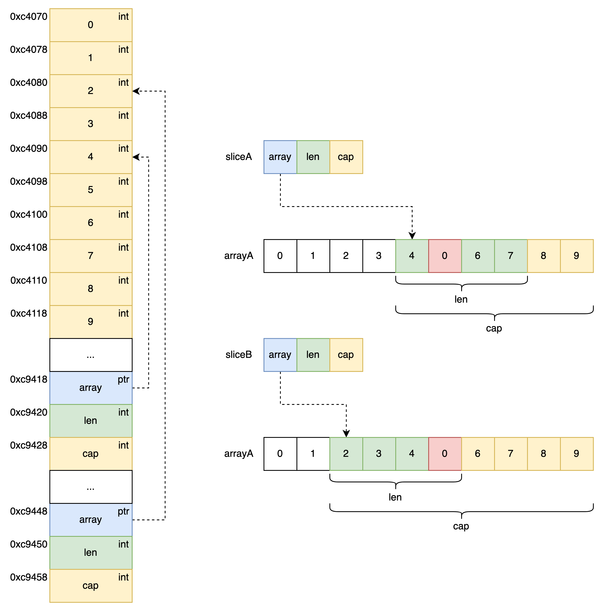

在上一篇中我们简单的了解了 slice ，在这一篇中我们将继续深入了解一下。
## Slice 数据结构
首先我们先来看一下 Slice 的数据结构，从 code - 1** **中我们可以看到 Slice 是由 3 部分构成，首先第一是名为 unsafe.Pointer（通用指针类型） 类型的 array，从命名中我们可以得知它是一个指向 Array 的指针，其余两个皆为 int 类型分别为 len 和 cap 分别代表 Slice 当前的长度，另一个代表 Slice 当前的容量。
```go
type slice struct {
	array unsafe.Pointer
	len   int
	cap   int
}
```

<center>code - 1 : Slice 数据结构</center><br>

- array unsafe.Pointer 类型，用于指向不同类型的 Array。
- len int 类型，用于表示当前 Slice 的长度，即当前元素的个数。
- cap int 类型，用于表示当前 Slice 的容量，即当前指针指向底层数组元素为起始位向后的总元素数量。
## Example
通过刚才数据结构 code - 1 中，想必我们已经对 Slice 有了一个更清楚的认知，Slice 本身并不是动态 Array，它更像是对 Array 的又一层封装，通过它内部实现的数据结构对底层 Array 的引用并将数据读写限定在指定区域内，其 Slice 本身只是一个只读对象。
既然 Slice 只是对底层 Array 的一个引用，那么通过 code - 2 中我们可以发现，一个 Array 可以被多个 slice 所引用，并且修改 Slice 上的元素其本质上也就是在修改所引用的底层 Array 中的元素，在此我们可以发现 Slice 是一个引用类型。
```go
package main

import (
    "fmt"
)

func revise(s []int, i int, v int) {
    s[i] = v
}

func main() {
    arrayA := [10]int{ 0, 1, 2, 3, 4, 5, 6, 7, 8, 9 }
    fmt.Printf("arrayA ---> %d\n", arrayA)
    fmt.Printf("address(arrayA) = %p\n", &arrayA)
    fmt.Printf("len(arrayA) = %d cap(arrayA) = %d\n", len(arrayA), cap(arrayA))
    fmt.Printf("\n")
    sliceA := arrayA[4:8]
    fmt.Printf("sliceA ---> %d\n", sliceA)
    fmt.Printf("address(sliceA) = %p\n", &sliceA)
    fmt.Printf("len(sliceA) = %d cap(sliceA) = %d\n", len(sliceA), cap(sliceA))
    fmt.Printf("\n")
    sliceB := arrayA[2:6]
    fmt.Printf("sliceB ---> %d\n", sliceB)
    fmt.Printf("address(sliceB) = %p\n", &sliceB)
    fmt.Printf("len(sliceB) = %d cap(sliceB) = %d\n", len(sliceB), cap(sliceB))
    revise(sliceB, 3, 0)
    fmt.Printf("\n")
    fmt.Printf("sliceA ---> %d\n", sliceA)
    fmt.Printf("address(sliceA) = %p\n", &sliceA)
    fmt.Printf("len(sliceA) = %d cap(sliceA) = %d\n", len(sliceA), cap(sliceA))
    fmt.Printf("\n")
    fmt.Printf("sliceB ---> %d\n", sliceB)
    fmt.Printf("address(sliceB) = %p\n", &sliceB)
    fmt.Printf("len(sliceB) = %d cap(sliceB) = %d\n", len(sliceB), cap(sliceB))
}

// arrayA ---> [0 1 2 3 4 5 6 7 8 9]
// address(arrayA) = 0xc000072000
// len(arrayA) = 10 cap(arrayA) = 10

// sliceA ---> [4 5 6 7]
// address(sliceA) = 0xc000010030
// len(sliceA) = 4 cap(sliceA) = 6

// sliceB ---> [2 3 4 5]
// address(sliceB) = 0xc000010060
// len(sliceB) = 4 cap(sliceB) = 8

// sliceA ---> [4 0 6 7]
// address(sliceA) = 0xc000010030
// len(sliceA) = 4 cap(sliceA) = 6

// sliceB ---> [2 3 4 0]
// address(sliceB) = 0xc000010060
// len(sliceB) = 4 cap(sliceB) = 8
```

<center>code - 2 : 声明 Slice</center><br>



<center>图 1 : Slice 内存布局</center><br>

## Make
Slice 的声明方式有很多，但都是字面量上的不同，下面我们从源代码 code - 3 中看看 make 函数的是如何做的，在此期间我们先来关注一下 len 与 cap 之间的关系，在 L3 中我们看到如果 len > cap 会直接报出 Panic，为此我们可以推断出 len 与 cap 之间的关系始终保持在 0 < len <= cap 。
```go
func makeslice(et *_type, len, cap int) unsafe.Pointer {
	mem, overflow := math.MulUintptr(et.size, uintptr(cap))
	if overflow || mem > maxAlloc || len < 0 || len > cap {
		// NOTE: Produce a 'len out of range' error instead of a
		// 'cap out of range' error when someone does make([]T, bignumber).
		// 'cap out of range' is true too, but since the cap is only being
		// supplied implicitly, saying len is clearer.
		// See golang.org/issue/4085.
		mem, overflow := math.MulUintptr(et.size, uintptr(len))
		if overflow || mem > maxAlloc || len < 0 {
			panicmakeslicelen()
		}
		panicmakeslicecap()
	}

	return mallocgc(mem, et, true)
}
```

<center>code - 3 : makeslice 函数</center><br>

- 0 < len <= cap 
- type.size 与 cap 的乘积不能越界，并且要小于 maxAlloc（允许用户分配的最大虚拟内存空间）
- type.size 与 len 的乘积不能越界，并且要小于 maxAlloc。
## Append
Append 函数是向 Slice 尾部添加元素，返回新的 slice 对象，但如果此时 Slice 的 cap 值小于当前 len 加上 append 中传入值的数量，就会调用 runtime.growslice 函数进行扩容，下面就让我们来深入了解一下函数 runtime.growslice 是如何对 Slice 进行扩容的。
首先我们先来看看扩容规则，其中 et 代表 slice 中的元素类型，old 是扩容前的切片，cap 是期望容量，也就是扩容后至少需要的最小容量，即 old.cap + 本次新增的元素数量。
```go
func growslice(et *_type, old slice, cap int) slice {
    ...
	newcap := old.cap
	doublecap := newcap + newcap
	if cap > doublecap {
		newcap = cap
	} else {
		const threshold = 256
		if old.cap < threshold {
			newcap = doublecap
		} else {
			// Check 0 < newcap to detect overflow
			// and prevent an infinite loop.
			for 0 < newcap && newcap < cap {
				// Transition from growing 2x for small slices
				// to growing 1.25x for large slices. This formula
				// gives a smooth-ish transition between the two.
				newcap += (newcap + 3*threshold) / 4
			}
			// Set newcap to the requested cap when
			// the newcap calculation overflowed.
			if newcap <= 0 {
				newcap = cap
			}
		}
	}
    ...
}
```

<center>code - 4 : growslice 函数扩容规则</center><br>

- 当前期望容量 > 2 倍扩容前 Slice 容量 。
   - 新容量 =  当前期望容量。
- 当前期望容量 < 2 倍扩容前 Slice 容量  && 扩容前 Slice 容量 > 256。
   - 新容量 =  2 倍扩容前 Slice 容量。
- 当前期望容量 < 2 倍扩容前 Slice 容量  && 扩容前 Slice 容量 < 256。
   - 新容量会从 2 倍扩容前 Slice 容量平滑的过渡到 1.25 倍扩容前 Slice 容量。

其次就是内存字节对齐，通过刚刚的扩容规则中 code - 4 中我们已经大致了解了各种情况中所要扩容的大小，但那并不是最终所要扩容的容量还会进行接下来的计算。
```go
func growslice(et *_type, old slice, cap int) slice {
    ...
	switch {
	case et.size == 1:
		lenmem = uintptr(old.len)
		newlenmem = uintptr(cap)
		capmem = roundupsize(uintptr(newcap))
		overflow = uintptr(newcap) > maxAlloc
		newcap = int(capmem)
	case et.size == goarch.PtrSize:
		lenmem = uintptr(old.len) * goarch.PtrSize
		newlenmem = uintptr(cap) * goarch.PtrSize
		capmem = roundupsize(uintptr(newcap) * goarch.PtrSize)
		overflow = uintptr(newcap) > maxAlloc/goarch.PtrSize
		newcap = int(capmem / goarch.PtrSize)
	case isPowerOfTwo(et.size):
		var shift uintptr
		if goarch.PtrSize == 8 {
			// Mask shift for better code generation.
			shift = uintptr(sys.Ctz64(uint64(et.size))) & 63
		} else {
			shift = uintptr(sys.Ctz32(uint32(et.size))) & 31
		}
		lenmem = uintptr(old.len) << shift
		newlenmem = uintptr(cap) << shift
		capmem = roundupsize(uintptr(newcap) << shift)
		overflow = uintptr(newcap) > (maxAlloc >> shift)
		newcap = int(capmem >> shift)
	default:
		lenmem = uintptr(old.len) * et.size
		newlenmem = uintptr(cap) * et.size
		capmem, overflow = math.MulUintptr(et.size, uintptr(newcap))
		capmem = roundupsize(capmem)
		newcap = int(capmem / et.size)
	}
    ...
}
```

<center>code - 5 : growslice 函数内存字节对齐</center><br>
