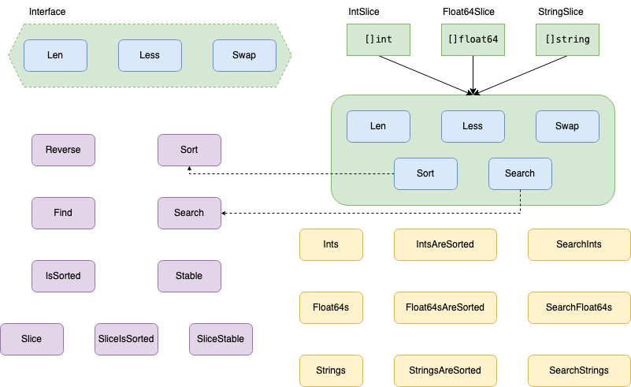

本周给大家带来的是 Go 语言标准库中的 sort 包， 该包提供了对切片和用户定义的集合进行排序的操作。

## Introduce

在本篇文章开始之前，我们需要先对 sort 包中的内容要有一个大致的了解，这对于我们接下来的学习有很大的帮助，如图 1 所示画出一个大概的关系图，要知道 sort 包并不只是有排序功能的。



<center>图 1：sort 包</center><br>

## Data Type

首先我们先从 sort 中的数据类型看起，在刚刚所看的图 1 中我们可以看到 sort 包中，共定义了四种数据类型，其中有三种是我们一般情况下经常会用到的数据类型，Go 语言的开发者们已经为我们写好了所需要的方法，而除去这三种基础类型后，还提供了一个接口类型，我们只需要在我们定义的数据类型中实现了接口中的三个方法就可以完成排序操作。

### Interface

老规矩先从 interface 的定义开始看起，从 code - 1 中我们可以看到在该 interface 中定义了三个方法，Len() 方法从注解中我们可以知道 Len 是集合中元素的个数，Less() 方法是对于集合中位于 i 位置的元素与位于 j 位置的元素做比较,位于 j 位置的元素大则返回 true 反之返回 false，Swap() 方法是对于集合中位于 i 位置的元素与位于 j 位置的元素进行交换操作。

那么从当前 interface 里的方法定义中我们可以知道，这些都是排序过程中经常会用到的操作，但对于不同的数据类型，这三个方法在定义中都会有略微的不同，更何况加上用户定义的数据类型，此时就展现了 interface 所带来的便利，sort 包的实现者无需知道要排序的数据类型是什么，只要按照当前所制定好的“协议”对当前所要排序类型实现了这三个方法，那么通过调用这三种方法就可进行排序操作。

```go
// In go1.19.2/src/sort/sort.go starting as line 14.

type Interface interface {
	// Len is the number of elements in the collection.
	Len() int

	// Less reports whether the element with index i
	// must sort before the element with index j.
	//
	// If both Less(i, j) and Less(j, i) are false,
	// then the elements at index i and j are considered equal.
	// Sort may place equal elements in any order in the final result,
	// while Stable preserves the original input order of equal elements.
	//
	// Less must describe a transitive ordering:
	//  - if both Less(i, j) and Less(j, k) are true, then Less(i, k) must be true as well.
	//  - if both Less(i, j) and Less(j, k) are false, then Less(i, k) must be false as well.
	//
	// Note that floating-point comparison (the < operator on float32 or float64 values)
	// is not a transitive ordering when not-a-number (NaN) values are involved.
	// See Float64Slice.Less for a correct implementation for floating-point values.
	Less(i, j int) bool

	// Swap swaps the elements with indexes i and j.
	Swap(i, j int)
}
```

<center>code - 1：sort 包中的 interface 类型</center><br>

### Int && Float64 && String

接下来就到了我们之前所说的三个基础的数据类型，我们从 code - 2 ～ 4 中可以看到这三种基础类型也是去实现了我们 code - 1 中的 interface 里的方法，并没有去单独实现。

```go
// In go1.19.2/src/sort/sort.go starting as line 112.

// IntSlice attaches the methods of Interface to []int, sorting in increasing order.
type IntSlice []int

func (x IntSlice) Len() int           { return len(x) }
func (x IntSlice) Less(i, j int) bool { return x[i] < x[j] }
func (x IntSlice) Swap(i, j int)      { x[i], x[j] = x[j], x[i] }

// Sort is a convenience method: x.Sort() calls Sort(x).
func (x IntSlice) Sort() { Sort(x) }
```

<center>code - 2：sort 包中的 int 类型</center><br>

```go
// In go1.19.2/src/sort/sort.go starting as line 123.

// Float64Slice implements Interface for a []float64, sorting in increasing order,
// with not-a-number (NaN) values ordered before other values.
type Float64Slice []float64

func (x Float64Slice) Len() int { return len(x) }

// Less reports whether x[i] should be ordered before x[j], as required by the sort Interface.
// Note that floating-point comparison by itself is not a transitive relation: it does not
// report a consistent ordering for not-a-number (NaN) values.
// This implementation of Less places NaN values before any others, by using:
//
//	x[i] < x[j] || (math.IsNaN(x[i]) && !math.IsNaN(x[j]))
func (x Float64Slice) Less(i, j int) bool { return x[i] < x[j] || (isNaN(x[i]) && !isNaN(x[j])) }
func (x Float64Slice) Swap(i, j int)      { x[i], x[j] = x[j], x[i] }

// isNaN is a copy of math.IsNaN to avoid a dependency on the math package.
func isNaN(f float64) bool {
	return f != f
}

// Sort is a convenience method: x.Sort() calls Sort(x).
func (x Float64Slice) Sort() { Sort(x) }
```

<center>code - 3：sort 包中的 float64 类型</center><br>

```go
// In go1.19.2/src/sort/sort.go starting as line 145.

// StringSlice attaches the methods of Interface to []string, sorting in increasing order.
type StringSlice []string

func (x StringSlice) Len() int           { return len(x) }
func (x StringSlice) Less(i, j int) bool { return x[i] < x[j] }
func (x StringSlice) Swap(i, j int)      { x[i], x[j] = x[j], x[i] }

// Sort is a convenience method: x.Sort() calls Sort(x).
func (x StringSlice) Sort() { Sort(x) }
```

<center>code - 4：sort 包中的 string 类型</center><br>

## Functions

那么数据类型我们看看完了，接下来我们需要了解的就是当前 sort 包中都提供了什么方法，以及这些方法是如何实现的。

### Sort

第一个要看的方法那一定就是我们的 Sort 方法了，Sort 方法的实现如下图所示，传入一个满足 interface 接口的实例，通过接口方法 Len 获取到当前数据的长度，在通过调用 bits 包中 Len 方法获取到当前存储数据长度的最小位数，执行 pdqsort 方法完成排序。

```go
// In go1.19.2/src/sort/sort.go starting as line 42.

func Sort(data Interface) {
	n := data.Len()
	if n <= 1 {
		return
	}
	limit := bits.Len(uint(n))
	pdqsort(data, 0, n, limit)
}
```

<center>code - 5：sort 方法</center><br>

接下来我们看一下 pdqsort 方法的代码实现，如 code - 6 所示，希望大家理解在教科书上出现的排序方法仅仅是为了理解排序问题而做出的课程安排，现实中的排序算法要复杂很多。

在 pdqsort 方法中我们可以看到，该方法中一共包含了三种排序算法，分别为插入排序、堆排序、快速排序，首先我们先忽略细节，看一下 pdqsort 方法的大体实现逻辑，当我们的数据结构长度小于 12 时直接调用插入排序，每进行一次递归我们的 limit 都会减 1，当 limit 等于 0 也就是递归执行次数消耗完毕时调用堆排序。

```go
// In go1.19.2/src/sort/zsortinterface.go starting as line 61.

// pdqsort sorts data[a:b].
// The algorithm based on pattern-defeating quicksort(pdqsort), but without the optimizations from BlockQuicksort.
// pdqsort paper: https://arxiv.org/pdf/2106.05123.pdf
// C++ implementation: https://github.com/orlp/pdqsort
// Rust implementation: https://docs.rs/pdqsort/latest/pdqsort/
// limit is the number of allowed bad (very unbalanced) pivots before falling back to heapsort.
func pdqsort(data Interface, a, b, limit int) {
	const maxInsertion = 12

	var (
		wasBalanced    = true // whether the last partitioning was reasonably balanced
		wasPartitioned = true // whether the slice was already partitioned
	)

	for {
		length := b - a

		if length <= maxInsertion {
			insertionSort(data, a, b)
			return
		}

		// Fall back to heapsort if too many bad choices were made.
		if limit == 0 {
			heapSort(data, a, b)
			return
		}

		// If the last partitioning was imbalanced, we need to breaking patterns.
		if !wasBalanced {
			breakPatterns(data, a, b)
			limit--
		}

		pivot, hint := choosePivot(data, a, b)
		if hint == decreasingHint {
			reverseRange(data, a, b)
			// The chosen pivot was pivot-a elements after the start of the array.
			// After reversing it is pivot-a elements before the end of the array.
			// The idea came from Rust's implementation.
			pivot = (b - 1) - (pivot - a)
			hint = increasingHint
		}

		// The slice is likely already sorted.
		if wasBalanced && wasPartitioned && hint == increasingHint {
			if partialInsertionSort(data, a, b) {
				return
			}
		}

		// Probably the slice contains many duplicate elements, partition the slice into
		// elements equal to and elements greater than the pivot.
		if a > 0 && !data.Less(a-1, pivot) {
			mid := partitionEqual(data, a, b, pivot)
			a = mid
			continue
		}

		mid, alreadyPartitioned := partition(data, a, b, pivot)
		wasPartitioned = alreadyPartitioned

		leftLen, rightLen := mid-a, b-mid
		balanceThreshold := length / 8
		if leftLen < rightLen {
			wasBalanced = leftLen >= balanceThreshold
			pdqsort(data, a, mid, limit)
			a = mid + 1
		} else {
			wasBalanced = rightLen >= balanceThreshold
			pdqsort(data, mid+1, b, limit)
			b = mid
		}
	}
}
```

<center>code - 6：pdqsort 方法</center><br>

#### insertionSort

插入排序相对来说大家都很了解，具体逻辑如图 2 所示，以数据结构索引位 1 开始向前一个元素进行比较，当 Less 方法返回 false 时进行元素交换，以此类推。

```go
// In go1.19.2/src/sort/zsortinterface.go starting as line 10.

// insertionSort sorts data[a:b] using insertion sort.
func insertionSort(data Interface, a, b int) {
	for i := a + 1; i < b; i++ {
		for j := i; j > a && data.Less(j, j-1); j-- {
			data.Swap(j, j-1)
		}
	}
}
```

<center>code - 7：insertionSort 方法</center><br>


<center>图 2：insertionSort</center><br>

#### heapSort

```go
// In go1.19.2/src/sort/zsortinterface.go starting as line 38.

func heapSort(data Interface, a, b int) {
	first := a
	lo := 0
	hi := b - a

	// Build heap with greatest element at top.
	for i := (hi - 1) / 2; i >= 0; i-- {
		siftDown(data, i, hi, first)
	}

	// Pop elements, largest first, into end of data.
	for i := hi - 1; i >= 0; i-- {
		data.Swap(first, first+i)
		siftDown(data, lo, i, first)
	}
}
```

<center>code - 8：heapSort 方法</center><br>


<center>图 3：heapSort</center><br>

```go
// In go1.19.2/src/sort/zsortinterface.go starting as line 20.

// siftDown implements the heap property on data[lo:hi].
// first is an offset into the array where the root of the heap lies.
func siftDown(data Interface, lo, hi, first int) {
	root := lo
	for {
		child := 2*root + 1
		if child >= hi {
			break
		}
		if child+1 < hi && data.Less(first+child, first+child+1) {
			child++
		}
		if !data.Less(first+root, first+child) {
			return
		}
		data.Swap(first+root, first+child)
		root = child
	}
}
```

<center>code - 9：siftDown 方法</center><br>


<center>图 4：siftDown</center><br>

### Find && Search

Find 与 Search 方法实现逻辑基本一致，都是使用了二分查找算法，具体逻辑如图 5 所示。

```go
// In go1.19.2/src/sort/search.go starting as line 99.

func Find(n int, cmp func(int) int) (i int, found bool) {
	// The invariants here are similar to the ones in Search.
	// Define cmp(-1) > 0 and cmp(n) <= 0
	// Invariant: cmp(i-1) > 0, cmp(j) <= 0
	i, j := 0, n
	for i < j {
		h := int(uint(i+j) >> 1) // avoid overflow when computing h
		// i ≤ h < j
		if cmp(h) > 0 {
			i = h + 1 // preserves cmp(i-1) > 0
		} else {
			j = h // preserves cmp(j) <= 0
		}
	}
	// i == j, cmp(i-1) > 0 and cmp(j) <= 0
	return i, i < n && cmp(i) == 0
}
```

<center>code - 10：Find 方法</center><br>

```go
// In go1.19.2/src/sort/search.go starting as line 58.

func Search(n int, f func(int) bool) int {
	// Define f(-1) == false and f(n) == true.
	// Invariant: f(i-1) == false, f(j) == true.
	i, j := 0, n
	for i < j {
		h := int(uint(i+j) >> 1) // avoid overflow when computing h
		// i ≤ h < j
		if !f(h) {
			i = h + 1 // preserves f(i-1) == false
		} else {
			j = h // preserves f(j) == true
		}
	}
	// i == j, f(i-1) == false, and f(j) (= f(i)) == true  =>  answer is i.
	return i
}
```

<center>code - 11：Search 方法</center><br>


<center>图 5：Slice</center><br>

### IsSorted

IsSorted 方法用来检查我们的数据是否进行过排序，其实现逻辑也很简单，我们通过接口方法 Len 获取到数据结构的长度，通过当前数据长度定位到数据结构中的倒数第一个与倒数第二个元素，并对其进行比较以此类推，如果后一位元素始终大于前一位元素，那么判定当前数据已排序。

```go
// In go1.19.2/src/sort/sort.go, starting as line 98.

// IsSorted reports whether data is sorted.
func IsSorted(data Interface) bool {
	n := data.Len()
	for i := n - 1; i > 0; i-- {
		if data.Less(i, i-1) {
			return false
		}
	}
	return true
}
```

<center>code - 12：IsSorted 方法</center><br>


<center>图 6：IsSorted</center><br>

### Slice && SliceStable

Slice 方法只需要提供给定的 less 函数，就会对传入切片 x 进行排序，如果 x 不是切片它会 panic，那么到这里我们不禁会想到一个问题 Slice 方法为什么只需要一个 less 方法就可以进行排序操作？

```c
// In go1.19.2/src/sort/slice.go, starting as line 18.

func Slice(x any, less func(i, j int) bool) {
	rv := reflectValueOf(x)
	swap := reflectSwapper(x)
	length := rv.Len()
	limit := bits.Len(uint(length))
	pdqsort_func(lessSwap{less, swap}, 0, length, limit)
}
```

<center>code - 13：Slice 方法</center><br>

思考一下可以想到，在 sort 包中 nterface 接口中， Len 方法与 Swap方法一般是不需要改动的，况且还是在切片类型中，而 Less 方法则需要指出具体的元素比较项，若每写一个新类型就需要实现这三种方法会比较麻烦，Go 的开发者解决了这个问题，在切片类型中我们只需提供 less 方法即可进行排序操作。

那么 Slice 方法是如何实现的呢？从 code - 14 中我们可以看到，Slice 方法通过调用 reflect 包的方法获得 Len 方法与 Swap 方法，对此我们暂时先不做深入研究。

```c
// In go1.19.2/src/sort/slice_go18.go, starting as line 8.

package sort

import "reflect"

var reflectValueOf = reflect.ValueOf
var reflectSwapper = reflect.Swapper
```

<center>code - 14：import 方法</center><br>

SliceStable 方法相比于 Slice 方法它们唯一的区别在于 SliceStable 方法会对传入的切片 x 进行排序的同时保持相等元素的原始顺序不变，从 code - 15 中我们可以看到在 SliceStable 方法里所调用的排序方法并不相同。

```c
// In go1.19.2/src/sort/slice.go, starting as line 32.

func SliceStable(x any, less func(i, j int) bool) {
	rv := reflectValueOf(x)
	swap := reflectSwapper(x)
	stable_func(lessSwap{less, swap}, rv.Len())
}
```

<center>code - 15：SliceStable 方法</center><br>

最后如 code - 16 所示，我们也可以在 sort 包中找到 Slice 与 SliceStable 方法排序方法中的函数中的 lessSwap 结构。

```c
// In go1.19.2/src/sort/sort.go, starting as line 74.

// lessSwap is a pair of Less and Swap function for use with the
// auto-generated func-optimized variant of sort.go in
// zfuncversion.go.
type lessSwap struct {
	Less func(i, j int) bool
	Swap func(i, j int)
}
```

<center>code - 16：lessSwap Struct</center><br>

### SliceIsSorted

SliceIsSorted 方法会检查所传入的切片 x 是否根据提供的 less 方法进行排序， 如果 x 不是切片它会 panic，该函数的具体实现逻辑与 IsSorted 方法基本一致。

```c
// In go1.19.2/src/sort/slice.go, starting as line 40.

// SliceIsSorted reports whether the slice x is sorted according to the provided less function.
// It panics if x is not a slice.
func SliceIsSorted(x any, less func(i, j int) bool) bool {
	rv := reflectValueOf(x)
	n := rv.Len()
	for i := n - 1; i > 0; i-- {
		if less(i, i-1) {
			return false
		}
	}
	return true
}
```

<center>code - 17：SliceIsSorted 方法</center><br>
