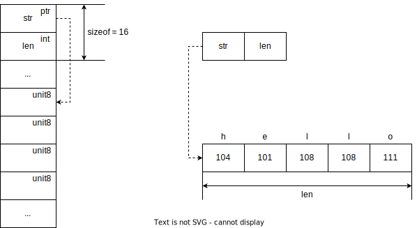

## 类型说明
在 Go 语言中所提供的字符串（string）是一种基础的数据类型，在编程开发中几乎随时都会使用，本篇文章将会介绍字符串（string）的知识，帮助你更好的理解它。
```go
// src/builtin/builtin.go

// string is the set of all strings of 8-bit bytes, conventionally but not
// necessarily representing UTF-8-encoded text. A string may be empty, but
// not nil. Values of string type are immutable.
type string string
```

<center>code - 1 ：string 类型说明</center><br>

- string 是所有 8 位字节字符串的集合，通常但不一定代表 UTF-8 编码的文本。
- 字符串可以为空（长度为 0 ），但不会是 nil。
- 字符串类型的值是不可变的
## 数据结构
首先我们先来看一下 string 类型的数据结构，从 code - 1 中我们可以看到 string 的数据结构与之前讲的 slice 数据结构很相似，他们都有一个指向底层数组的指针用存储数据，和表示数组长度的字段 len，从这点中可以发现许多数据结构的存储方式都依赖于数组，与之不同的是 slice 多出一个表示容量的 cap 字段。
```go
// src/runtime/string.go

type stringStruct struct {
	str unsafe.Pointer
	len int
}
```

<center>code - 2 ：string 数据结构</center><br>

## 类型声明
如 code - 2 所示我们可以使用两种字面量方式在 Go 语言中声明字符串，即双引号和反引号：使用双引号声明的字符串和其他语言中的字符串没有太多的区别，它只能用于单行字符串的初始化，如果字符串内部出现双引号，需要使用 \ 符号避免编译器的解析错误，而反引号声明的字符串可以摆脱单行的限制。
```go
var str string

str = "hello"
str = "hello \"world"
str = `hello
world`
```

<center>code - 3 ：声明 string 变量并赋值</center><br>

如图 1 所示，虽然字符串往往都被看做是一个整体，但是实际上字符串是一片连续的内存空间，我们也可以将它理解成一个由字符组成的数组。


<center>图 1：string 类型的内存布局</center><br>

当使用反引号时，因为双引号不再负责标记字符串的开始和结束，我们可以在字符串内部直接使用双引号，在遇到需要手写 JSON 或者其他复杂数据格式的场景下非常方便。
```go
var str string

str = `{
    "str": unsafe.Pointer(str),
    "len": findnull(str)
}`
```

<center>code - 4 ：使用 ` 赋值 string 类型</center><br>

## 解析
那么既然 Go 语言中对 string 类型有两种不同的声明方式即双引号和反引号，那么这也意味着 Go 语言编译器需要能够区分并且正确解析两种不同的字符串格式，在 code - 0 中我们不难发现 Go 语言在解析两种不同的字符串格式中所采用的解析函数 stdString() 与 rawString()。
```go
// src/cmd/compile/internal/syntax/scanner.go

func (s *scanner) next() {

    ...

	switch s.ch {

    ...
    
	case '"':
		s.stdString()

	case '`':
		s.rawString()

	...

}
```

<center>code - 5 ：语法解析</center><br>

### stdString()
stdString() 方法是它用来解析使用双引号声明的标准字符串，从 stdString() 方法中我们可以看到 Go 语言对标准字符串的解析逻辑，通过 nextch() 函数来获取最新的未解析的字符，以双引号表示开头和结尾，以反斜杠 \ 来逃逸双引号，并且不允许出现隐式换行 \n。
```go
// src/cmd/compile/internal/syntax/scanner.go

func (s *scanner) stdString() {
	ok := true
	s.nextch()

	for {
		if s.ch == '"' {
			s.nextch()
			break
		}
		if s.ch == '\\' {
			s.nextch()
			if !s.escape('"') {
				ok = false
			}
			continue
		}
		if s.ch == '\n' {
			s.errorf("newline in string")
			ok = false
			break
		}
		if s.ch < 0 {
			s.errorAtf(0, "string not terminated")
			ok = false
			break
		}
		s.nextch()
	}

	s.setLit(StringLit, ok)
}
```

<center>code - 6 ：stdString() 方法</center><br>

### rawString()
rawString() 方法是它用来解析使用反引号声明的字符串，使用反引号声明的原始字符串的解析规则就非常简单了，rawString() 方法会将非反引号的所有字符都划分到当前字符串的范围中，所以我们可以使用它支持复杂的多行字符串。
```go
// src/cmd/compile/internal/syntax/scanner.go

func (s *scanner) rawString() {
	ok := true
	s.nextch()

	for {
		if s.ch == '`' {
			s.nextch()
			break
		}
		if s.ch < 0 {
			s.errorAtf(0, "string not terminated")
			ok = false
			break
		}
		s.nextch()
	}
	// We leave CRs in the string since they are part of the
	// literal (even though they are not part of the literal
	// value).

	s.setLit(StringLit, ok)
}
```

<center>code - 7 ：rawString() 方法</center><br>

并通过 string(s.segment()) 将解析到的字节转换为字符串，同时通过 setLlit() 方法将扫描到的内容类型 (kind) 标记为 StringLit。
无论是标准字符串还是原始字符串都会被标记成 StringLit 并传递到语法分析阶段。在语法分析阶段，与字符串相关的表达式都会由 setLit() 方法处理：
```go
// src/cmd/compile/internal/syntax/scanner.go

// setLit sets the scanner state for a recognized _Literal token.
func (s *scanner) setLit(kind LitKind, ok bool) {
	s.nlsemi = true
	s.tok = _Literal
	s.lit = string(s.segment())
	s.bad = !ok
	s.kind = kind
}

// src/cmd/compile/internal/syntax/source.go

func (s *source) segment() []byte { return s.buf[s.b : s.r-s.chw] }
```

<center>code - 8 ：setLit() 方法</center><br>

## 拼接

```go
// src/runtime/string.go

// concatstrings implements a Go string concatenation x+y+z+...
// The operands are passed in the slice a.
// If buf != nil, the compiler has determined that the result does not
// escape the calling function, so the string data can be stored in buf
// if small enough.
func concatstrings(buf *tmpBuf, a []string) string {
	idx := 0
	l := 0
	count := 0
	for i, x := range a {
		n := len(x)
		if n == 0 {
			continue
		}
		if l+n < l {
			throw("string concatenation too long")
		}
		l += n
		count++
		idx = i
	}
	if count == 0 {
		return ""
	}

	// If there is just one string and either it is not on the stack
	// or our result does not escape the calling frame (buf != nil),
	// then we can return that string directly.
	if count == 1 && (buf != nil || !stringDataOnStack(a[idx])) {
		return a[idx]
	}
	s, b := rawstringtmp(buf, l)
	for _, x := range a {
		copy(b, x)
		b = b[len(x):]
	}
	return s
}
```

<center>code - 9 ：concatstrings </center><br>

## 类型转换
### 将字节片转换为字符串
Slicebytetostring() 方法是将字节片转换为字符串，它由编译器插入到生成的代码中，ptr 是指向片的第一个元素的指针，n 是 slice 的长度，buf 是结果的固定大小的缓冲区，那么我们就来看看该方法的具体过程吧，首先可以看到该方法先判断了两种情况，分别为字节数组长度为 0 或者 1 的时候，随后就是判断缓冲区的大小是否可以够用，如果不够就会为新字符串分配一片内存空间，stringStructOf() 方法会将传入的字符串指针转换成 stringStruct 的结构体指针，然后设置结构体持有的字符串指针 str 和长度 len，最后通过 memmove() 方法将原 []byte 中的字节全部复制到新的内存空间中。
```go
// The constant is known to the compiler.
// There is no fundamental theory behind this number.
const tmpStringBufSize = 32

type tmpBuf [tmpStringBufSize]byte

// slicebytetostring converts a byte slice to a string.
// It is inserted by the compiler into generated code.
// ptr is a pointer to the first element of the slice;
// n is the length of the slice.
// Buf is a fixed-size buffer for the result,
// it is not nil if the result does not escape.
func slicebytetostring(buf *tmpBuf, ptr *byte, n int) (str string) {
	if n == 0 {
		// Turns out to be a relatively common case.
		// Consider that you want to parse out data between parens in "foo()bar",
		// you find the indices and convert the subslice to string.
		return ""
	}
	if raceenabled {
		racereadrangepc(unsafe.Pointer(ptr),
			uintptr(n),
			getcallerpc(),
			abi.FuncPCABIInternal(slicebytetostring))
	}
	if msanenabled {
		msanread(unsafe.Pointer(ptr), uintptr(n))
	}
	if asanenabled {
		asanread(unsafe.Pointer(ptr), uintptr(n))
	}
	if n == 1 {
		p := unsafe.Pointer(&staticuint64s[*ptr])
		if goarch.BigEndian {
			p = add(p, 7)
		}
		stringStructOf(&str).str = p
		stringStructOf(&str).len = 1
		return
	}

	var p unsafe.Pointer
	if buf != nil && n <= len(buf) {
		p = unsafe.Pointer(buf)
	} else {
		p = mallocgc(uintptr(n), nil, false)
	}
	stringStructOf(&str).str = p
	stringStructOf(&str).len = n
	memmove(p, unsafe.Pointer(ptr), uintptr(n))
	return
}
```

<center>code - 10 slicebytetostring </center><br>

### 将字符串转换为字节片
stringtoslicebyte() 方法是将字符串转换为字节片，buf 是结果的固定大小的缓冲区，s 是要进行转换的字符串，该方法会根据是否传入缓冲区做出不同的处理，当传入缓冲区时，它会使用传入的缓冲区存储 []byte，当没有传入缓冲区时，运行时会调用 rawbyteslice() 方法创建新的字节切片并将字符串中的内容拷贝过去。
```go
func stringtoslicebyte(buf *tmpBuf, s string) []byte {
	var b []byte
	if buf != nil && len(s) <= len(buf) {
		*buf = tmpBuf{}
		b = buf[:len(s)]
	} else {
		b = rawbyteslice(len(s))
	}
	copy(b, s)
	return b
}
```

<center>code - 11 stringtoslicebyte </center><br>