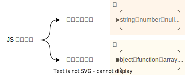

## JS 数据类型
JavaScript 是一种动态类型的语言，这意味着变量可以在程序执行期间更改其数据类型。JavaScript 提供了多种数据类型，可以大致分为两类：基本数据类型（也称为原始值）和引用数据类型。


<center>图 1：JS 数据类型</center><br>

### 基本数据类型
基本数据类型直接存储在栈内存中，它们的值是不可变的，这是因为当我们想从新给基础类型赋值来“改变”它们的值时，实际上是创建了一个新的基本数据类型实例，并将其分配给当前的变量名中。

这样的好处在于，基本数据类型的值不可变，所以在代码中传递这些值时不需要担心它们被意外地修改。这有助于编写无副作用的纯函数，并提高程序的可预测性和稳定性。

```javascript
let myNum = 42; // 创建一个数值变量
myNum = 43; // 不是改变原来的数值，而是创建一个新的数值并重新分配给 myNum
```
<center>code - 1：给基础类型赋值</center><br>

在 code - 1 中，myNum 变量最初存储的是整数 42，然后通过重新赋值将其改为 43。实际上，这是创建了两个不同的 Number 实例，而不是直接改变了原始数值的值。

### 引用数据类型
引用数据类型存储在堆内存中，它们的值是可以改变的，值得注意的是 引用数据类型都是以 object 的基础上派生的，所以除了 null 类型以外，所有的引用类型都是 typeof 运算符返回结果为 object 的对象。

如果你需要区分具体的引用类型，可以使用 instanceof 操作符或者检查构造函数名称。

```javascript
let arr = []
window.console.log(arr instanceof Array) // true
window.console.log(arr.constructor.name) // Array
```
<center>code - 2：区分具体的引用类型</center><br>

## 浅拷贝与深拷贝
在 JavaScript 中，深拷贝和浅拷贝一般情况都是在引用数据类型的基础上所讨论的，它们是两种不同的复制对象的方式，区别就在于复制的深度以及对原始对象和副本之间关系的影响。

这主要是因为在引用类型中，当我们将变量赋值给另一个变量时，实际上是将它们的引用地址复制了一份。这样，当我们对其中一个变量进行修改时，另一个变量也会受到影响。因此，为了避免这种情况的发生，所以我们通常需要使用拷贝的手段来创建一个新的副本。


<center>图 2：引用数据类型</center><br>

```javascript
let objA = { name: "Li Ming", age: 18 }
let objB = objA

objA.name = "Xiao Hua"

window.console.log(objA) // { name: "Xiao Hua", age: 18 }
window.console.log(objB) // { name: "Xiao Hua", age: 18 }
```
<center>code - 3：修改原变量时另一个变量也会受到影响</center><br>

### 浅拷贝
浅拷贝只复制了对象的第一层属性值，而不复制其内部的引用。当对象包含其他对象或数组作为属性时，浅拷贝只会创建这些嵌套对象或数组的引用副本，而不是实际的对象或数组本身。因此，如果修改了原对象中的嵌套对象或数组，那么这个修改也会反映到浅拷贝后的副本上，因为它们共享相同的引用。


<center>图 3：浅拷贝</center><br>

```javascript
let objA = { name: "Li Ming", score: [80, 60, 90] }
let objB = { ...objA }

objA.name = "Xiao Hua"
objA.score[0] = 100

window.console.log(objA) // { name: "Xiao Hua", score: [100, 60, 90] }
window.console.log(objB) // { name: "Li Ming", score: [100, 60, 90] }
```
<center>code - 4：修改原对象中的数组，反映到浅拷贝后的副本上</center><br>

值得注意的是在 code - 5 中，我们修改了原对象中嵌套的数组，但这个修改没有反映到浅拷贝后的副本上，这是因为我们相当于重写了一个数组，如果重写的话，那么他相当于在堆内存中重新开辟了一块空间这样修改之后的这个数组与之前修改的数组会分别处在两个不同地址的内存空间中且他们互不影响，同理此种情况也适用于对象与函数。

```javascript
let objA = { name: "Li Ming", score: [80, 60, 90] }
let objB = { ...objA }

objA.name = "Xiao Hua"
objA.score = [100, 60, 90]

window.console.log(objA) // { name: "Xiao Hua", score: [100, 60, 90] }
window.console.log(objB) // { name: "Li Ming", score: [80, 60, 90] }
```
<center>code - 5：重写一个数组并赋值</center><br>

### 深拷贝
深拷贝会递归地复制整个对象及其所有嵌套的对象和数组。它会在内存中为每个被复制的对象分配新的空间，并将所有的属性值都复制过去。这意味着即使原对象中的嵌套对象或数组发生了变化，也不会影响到深拷贝后的副本，因为它们各自拥有独立的内存空间。


<center>图 3：深拷贝</center><br>

实现深拷贝的方法有很多种，只要达到它们各自拥有独立的内存空间且互不干扰，例如使用 JSON.stringify 方法将对象转换为 JSON 字符串，然后使用 JSON.parse 方法将 JSON 字符串解析为新的对象，这样也可以实现深拷贝。但是，这种方法有一些局限性，例如它不能处理函数和 undefined。

```javascript
let objA = {
  name: "Li Ming",
  score: [80, 60, 90],
  select: function () {
    return this.name
  },
  age: undefined,
}
let objB = JSON.parse(JSON.stringify(objA))

window.console.log(objA) // { name: "Li Ming", score: [80, 60, 90], select: ƒ, age: undefined }
window.console.log(objB) // { name: "Li Ming", score: [80, 60, 90] }
```
<center>code - 6：JSON.parse 与 JSON.stringify</center><br>

我们也可以手动去实现一个深拷贝，实现该方法通常需要递归地复制对象的所有属性，并创建任何嵌套对象或数组的新副本。

```javascript
function deepCopy(obj) {
  // 对于非对象和null值，直接返回
  if (obj === null || typeof obj !== "object") return obj

  // 根据obj的类型来决定新创建对象的类型
  let copy = Array.isArray(obj) ? [] : {}

  for (let key in obj) {
    if (obj.hasOwnProperty(key)) {
      // 递归调用deepCopy处理每个属性
      copy[key] = deepCopy(obj[key])
    }
  }

  return copy
}
```
<center>code - 7：手动实现深拷贝</center><br>
