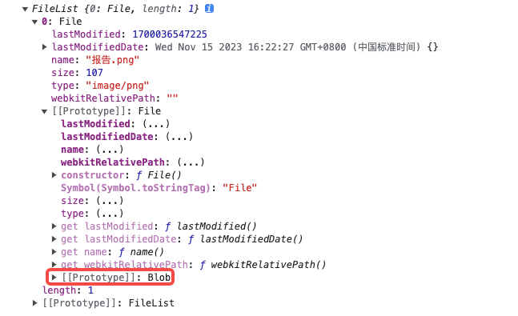
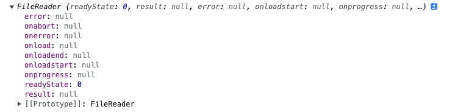
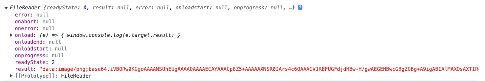

## Blob
Blob 是 JavaScript 中的一个对象，其全称为 binary large object（二进制大对象），用于表示一个不可变、原始数据的类文件对象，它本身是不能直接读写所存储的数据，需要借助图 1 中来对它的数据以不同形式的格式进行读取操作。


<center>图 1：Blob</center><br>

## File
File 对象中存在于浏览器环境中，在 node.js 环境中不存在，并且 Blob 的属性和方法都可以应用于 File 对象上，对此我们可以将 File 对象看作是特殊类型的 Blob，且可以用在任意的 Blob 类型的 context 中,比如: FileReader, URL.createObjectURL, createImageBitmap, 及 XMLHttpRequest.send 都能处理 Blob 和 File 对象。


<center>图 2：File</center><br>

从图 2 可以看出 File 对象相比于 Blob 对象多包含了一些文件属性，File 原型中可以了解 File 是继承自 Blob。


<center>图 3：File 继承 Blob</center><br>

### 前端获取文件的几种情况
#### input 上传
创建 `<input>` 元素并在其上绑定 onchange 事件，在通过用户点击上传后获取 FileList 对象，其中 input 标签中 type 是用来决定用户的输入类型，multiple 是用来确定是否可以同时上传多个文件。

```html
<input id="cake" type="file" multiple="multiple" />
```
<center>code - 1：HTML input</center><br>

```javascript
const selectElement = window.document.getElementById("cake")

selectElement.onchange = (event) => {
  window.console.log(event.target.files)
}
```
<center>code - 2：onchange</center><br>

#### 文件拖放
创建一个 `<div>` 标签或者创建其他任意一种标签，通过绑定 ondragover 与 ondrop 事件来完成将浏览器之外的文件拖拽到浏览器窗口中，并将它放在一个成为拖放区域的特殊区域中，也就是之前所创建的 `<div>` 标签中。

- ondragover：当元素或选中的文本被拖到一个可释放目标上时触发（每 100 毫秒触发一次）。
- ondrop：当元素或选中的文本在可释放目标上被释放时触发。

```html
<div id="cake"></div>
```
<center>code - 3：HTML div</center><br>

```javascript
const selectElement = window.document.getElementById("cake")
  
selectElement.ondragover = (event) => {
  event.preventDefault()
}
  
selectElement.ondrop = (event) => {
  event.preventDefault()
  window.console.log(event.dataTransfer.files)
}
```
<center>code - 4：ondragover & ondrop</center><br>

```css
##cake {
  width: 200px;
  height: 200px;
  border: 1px solid black;
}
```
<center>code - 5：CSS cake</center><br>

值得注意的是在 ondragover 与 ondrop 事件中均调用 preventDefault() 来阻止对这个事件的其他处理过程（如触点事件或指针事件更或者是放置文件时将文件显示在浏览器窗口中），但此事件还是会继续传播，除非碰到事件监听器调用 stopPropagation() 或 stopImmediatePropagation() 才停止传播。

#### showOpenFilePicker API
通过 window.showOpenFilePicker() 方法，该方法用于显示一个文件选择器，以允许用户选择一个或多个文件并返回这些文件的句柄。

```html
<button id="cake">点击上传文件</button>
```
<center>code - 6：HTML button</center><br>

```javascript
const selectElement = window.document.getElementById("cake")

selectElement.onclick = async () => {
  const pickerOpts = {
    types: [
      {
        description: "Images",
        accept: {
          "image/*": [".png", ".gif", ".jpeg", ".jpg"],
        },
      },
    ],
    excludeAcceptAllOption: true,
    multiple: false,
  }

  const [fileHandle] = await window.showOpenFilePicker(pickerOpts)

  window.console.log(fileHandle)
}
```
<center>code - 7：showOpenFilePicker API</center><br>

值得注意的是 window.showOpenFilePicker() API 较新，使用时需注意此项功能仅在一些支持的浏览器的安全上下文（HTTPS）中可用，在将其用于生产之前，需仔细检查浏览器兼容性。

#### 请求远端
通过 fetch 或 axios 等获取远端文件，这也是我们最常用到的。

```javascript
fetch("../src/assets/image/cake.png")
  .then(async (responce) => {
    window.console.log(await responce.blob())
  })
  .catch((err) => {
    window.console.log(err)
  })
```
<center>code - 8：fetch</center><br>

## FileReader
FileReader 对象允许 Web 应用程序异步读取存储在用户计算机上的文件（但不能用于从文件系统中按路径名简单地读取文件）或原始数据缓冲区的内容，使用 File 或 Blob 对象指定要读取的文件或数据。
简单来说 FileReader 是一个异步 API，它允许接受 File 或 Blob 对象，并根据我们的要求读取成我们想要的文件或数据类型。


<center>图 4：FileReader</center><br>

FileReader 对象可以使用 FileReader 构造函数来创建，并从图 5 中分别可以看到 FileReader 对象所提供的属性与事件处理。

```javascript
const fr = new FileReader()
window.console.log(fr)
```
<center>code - 9：new FileReader</center><br>


<center>图 5：Print FileReader</center><br>

FileReader 对象属性如下：

- error（只读）：表示在读取文件时发生的错误；
- readyState（只读）：表示 FileReader 状态的数字，取值如下：0（EMPTY）还没有加载任何数据、1（LOADING）数据正在被加载、2（DONE）已完成全部的读取请求。
- result（只读）：文件的内容，该属性仅在读取操作完成后才有效，数据的格式取决于使用哪个方法来启动读取操作。

FileReader 对象事件处理如下：

- onabort：该事件在读取操作被中断时触发。
- onerror：该事件在读取操作发生错误时触发。
- onload：该事件在读取操作完成时触发。
- onloadstart：该事件在读取操作开始时触发。
- onloadend：该事件在读取操作结束时（要么成功，要么失败）触发。
- onprogress：该事件在读取 Blob 时触发，当上传大文件时，可以用该事件来监控文件的读取进度。

回归正文，在图 4 中可以看到 FileReader 对象可以将 File 或 Blob 输出成不同的数据格式，所以可以把 FileReader 对象看成一个工具，该工具提供了一些读取方法，这关乎着 result 属性最后所呈现的文件内容，FileReader 对象提供了以下方法来加载文件：

- readAsArrayBuffer: 读取指定 Blob 中的内容，完成之后，result 属性中保存的将是被读取文件的 ArrayBuffer 数据对象。
- readAsBinaryString: 读取指定 Blob 中的内容，完成之后，result 属性中将包含所读取文件的原始二进制数据。
- readAsDataURL: 读取指定 Blob 中的内容，完成之后，result 属性中将包含一个data: URL 格式的 Base64 字符串以表示所读取文件的内容。
- readAsText: 读取指定 Blob 中的内容，完成之后，result 属性中将包含一个字符串以表示所读取的文件内容。

以 readAsDataURL 方法为例，首先创建一个 FileReader 对象，当文件上传成功时，使用该方法读取 File 对象，当读取操作完成时打印读取结果。

```html
  <input id="cake" type="file" />
```
<center>code - 10：HTML input</center><br>

```javascript
const selectElement = window.document.getElementById("cake")

const fr = new FileReader()

fr.onload = (e) => {
  window.console.log(e.target.result)
}

selectElement.onchange = (event) => {
  fr.readAsDataURL(event.target.files[0])
}
```
<center>code - 11：readAsDataURL</center><br>

如果此时打印 FileReader 对象我们就可以看见 readyState 状态为已完成、 onload 事件为我们刚刚定义的方法、 result 内容为 readAsDataURL 方法启动的读取结果。


<center>图 6：Print FileReader</center><br>

## ArrayBuffer
ArrayBuffer 对象用来表示通用的、固定长度的原始二进制数据缓冲区，ArrayBuffer 的内容不能直接操作，只能通过 DataView 对象或 TypedArrray 对象来访问，这些对象用于读取和写入缓冲区内容。
TypedArrray 视图与 DataView 视图的区别主要是字节序，前者的数组成员都是同一个数据类型，后者的数组成员可以是不同的数据类型。

- TypedArrray 只是一个概念，实际使用的是那图 7 中的 9 个对象。
- DataView 可以自定义格式和字节序，更像是 TypeScript 中的元祖。


<center>图 7：ArrayBuffer</center><br>

Blob 相较于 ArrayBuffer 它作为一个整体文件，更适合用于文件传输，当需要对二进制数据进行操作时（例如修改文件中某一段数据时）就可以使用 ArrayBuffer 来完成。

```javascript
const Hello = [72, 101, 108, 108, 111, 32, 119, 111, 114, 108, 100]

const buffer = new ArrayBuffer(Hello.length)

const wrapBuffer = new Int8Array(buffer)

for (let i = 0; i < Hello.length; i++) {
  wrapBuffer[i] = Hello[i]
}

const blob = new Blob([buffer])

const reader = new FileReader()

reader.readAsText(blob)

window.console.log(reader)
```
<center>code - 12：通过 ArrayBuffer 生成 Blob</center><br>
